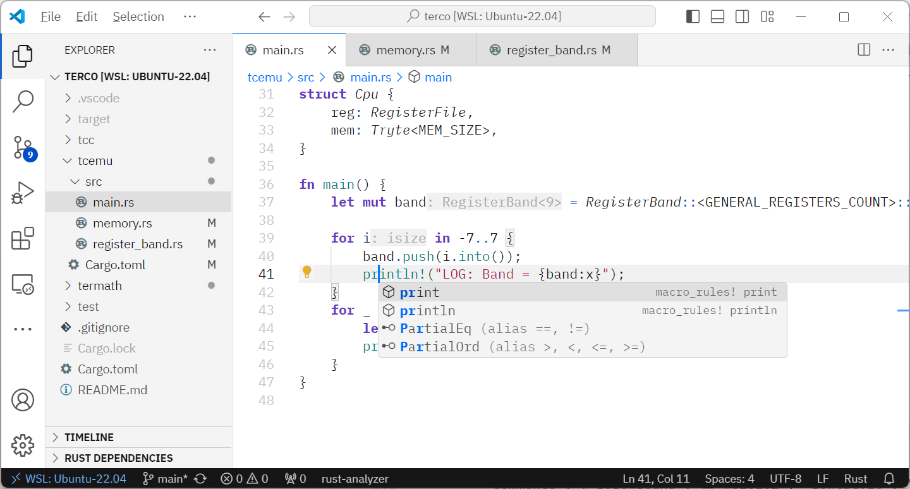
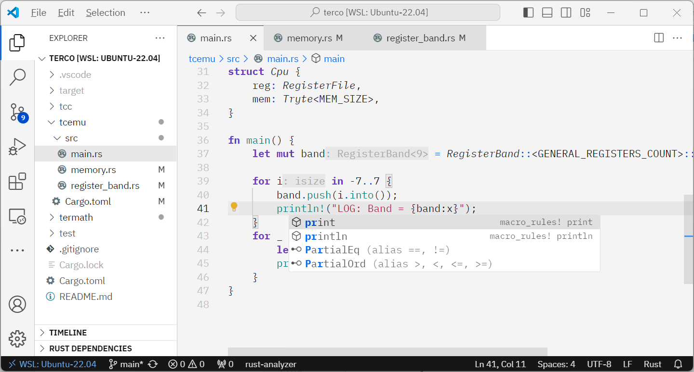
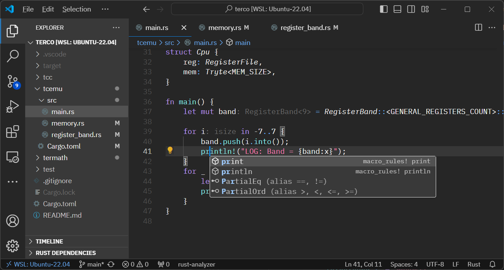
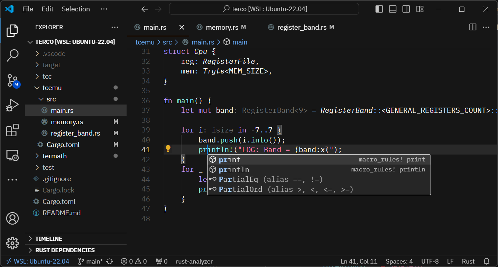

# IBM Carbon Design System themes

UI color themes and syntax highlighting based on the [IBM Carbon Design System](https://carbondesignsystem.com/).


## Details

The package includes syntax highlighting and UI themes. Each theme uses slightly different approach to the UI interpretation, since IBM Carbon provides options.

  - White
  - Gray 10
  - Gray 90
  - Gray 100  


## Screenshots

White theme:   
Gray 10 theme:   
Gray 90 theme:   
Gray 100 theme:   


## Font Recommendations

The themes are designed to work with the following fonts:  
- Editor font: [IBM Plex Mono][1]
- Terminal font: [IBM Plex Mono][1]
- UI font: [IBM Plex Sans][1]

The UI font can be changeg using [Apc Cusomize UI++][2] extension by __drcika__.

Add following lines to your `settings.json`:

```jsonc
//settings.json
{
  ...
  "editor.fontFamily": "IBM Plex Mono, monospace",
  "terminal.integrated.fontFamily": "IBM Plex Mono, monospace",

  //Requires APC Extension:
  "apc.font.family": "IBM Plex Sans",  
  ...
}
```

## Author and Licence

Dmitry Achkasov <achkasov.dmitry@live.com>, 2024, CC BY.


[0]: References:
[1]: https://github.com/IBM/plex
[2]: https://marketplace.visualstudio.com/items?itemName=drcika.apc-extension